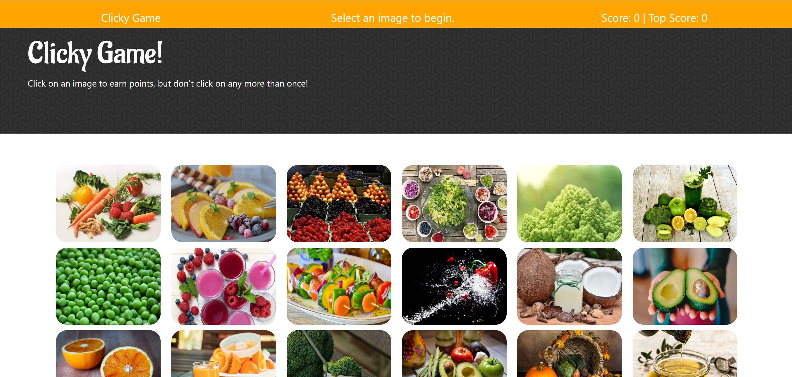

# Clicky - a memory game challenge.
Challenge yourself to a React Memory game. Click on a food image to start the game.  The images will be reshuffled.  If your next click is a new image, you get a point.  If you forget, and click an image that you have already clicked... You lose the game.
Choose 12 unique images in a row and you win the game!

## Deployed on Heroku
https://webscraperld.herokuapp.com/

## Deployed on Nelify 
https://laughing-wright-1976ad.netlify.com/

## Skills
React

Node.js

Yarn

Bootstrap 

JSX

JavaScript

Adobe Edge Web Fonts 

http://backgroundhost.com/

